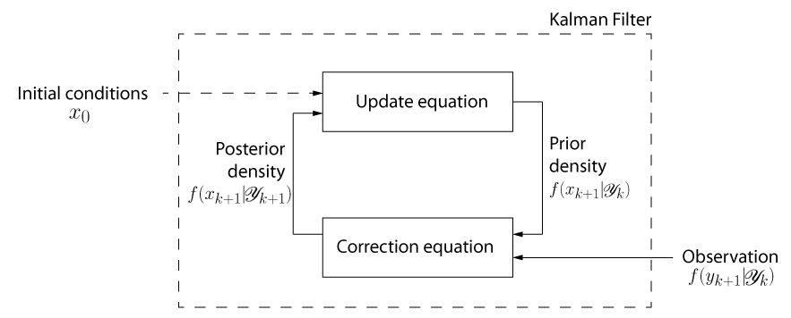

= Parametric Approach To Bayesian Drift Estimation of Discretely Observed Price Diffusion Processes
:author: Alexandry Augustin
:toc: preamble

:fedora-url: https://getfedora.org/
:matlab-url: https://www.mathworks.com/products/matlab.html
:octave-url: https://octave.org/
:octave-download: https://octave.org/download

This repository contains the code, manuscript, datasets, and other materials from my thesis submitted in partial fulfilment of the degree of https://www.imperial.ac.uk/study/pg/mathematics/mathematics-finance/[MSc in Mathematics and Finance] at https://www.imperial.ac.uk/[Imperial College London].

== Motivation

Financial market participants often rely on market regimes to adjust investment decisions; and as such, 
they are looking to quickly detect changes in market performance (i.e. growth or decline).
Unfortunately, the recovery of information from asset prices corrupted by uncertainty has long been a struggle endured by many financial investors.
Typical to financial asset prices, the volatility is usually very large compare to the trend resulting in difficult accurate estimation.

We introduce a methodology for analysing and forecasting the direction of asset prices using past market data.
We model asset prices using stochastic processes and make inference on the instantaneous trend using a Kalman filter [<<kalman_1960, "Kalman, 1960">>].
The method we propose is applicable to a large class of discretly observed diffusion processes; 
including those for which observations are irregularly spaced, those in which the data are observed with error due to factors such as market microstructure.

.Ongoing Kalman filter cycle.

== Compiling the Manuscript

The manuscript is located in the `manuscript` directory.

Run the following command to compile the manuscript:

[source,bash]
----
latexmk manuscript.tex -pdf
----
// NOTE: The above will fail if `-pdf` is not specified

If the above command ran successfully, the file `manuscript.pdf` will be created in the `manuscript` directory.

NOTE: You can optionally run the following command to clean the directory of all temporary files generated during compilation:

[source,bash]
----
latexmk -c
----

== Reproducing the Results

All source code used to generate the results and figures in the paper are in the `code` directory.
The code has been written using {octave-url}[GNU Octave], an open-source implementation of the commercial {matlab-url}[Matlab] product. 
GNU Octave is largely compatible with MATLAB and provides a very similar command line interpreter interface.

GNU Octave can be downloaded {octave-download}[here] for your specific platform. Or using the folling command on the {fedora-url}[Fedora] Linux distribution.

[source,bash]
----
sudo dnf install octave
----

Use the following command to run a GNU Octave script:

[source,bash]
----
octave filename.m
----

You can also use the REPL to run functions. 
For example:

[source,bash]
----
octave

run kalmanPosition(100)
----

== References

. [[[kalman_1960]]]Kalman, Rudolph Emil. "A new approach to linear filtering and prediction problems." (1960): 35-45.

== Acknowledgments

I would like to cordially thank Dr. Chris Barnett for his advice and help in the production of this work.

== License

All source code is made available under the MIT license. 
You can freely use and modify the code, without warranty, so long as you provide attribution to the authors. 
See link:./LICENSE[LICENSE] for the full license text.
